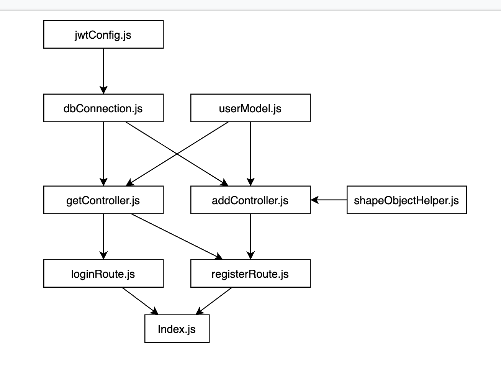

# Welcome to Transaction API!
## How to run the project
You need to install required dependencies (libraries) by typing in the terminal
```bash
npm install
```
Then you can run this project by:
- Using node
  ```bash
  npm start
  ```
- Using nodemon
  ```bash
  npm run dev
  ```
----------
## Understanding the codebase
After your lead fork this project and invites the member, your team should read the code first and make the code easier to understand by giving nessesarry comments, remember! **A good teamwork requires a good chair**, make the code easier to understand gives your team agility to create features!

Don't understand what I meant? For example, this is signJwt() function inside [jwtMiddleware.js](/middlewares/jwtMiddleware.js)
```javascript
function signJwt(data) {
  const token = jwt.sign(data, jwtConfig.secret, jwtConfig.options)
  return token
}
```
You can add comments to this code like
```javascript
// data parameter is user object that is inputted from loginRoute.js
function signJwt(data) {
  // this code will create a jwt token, by using data parameter, jwtConfig secret & options in jwtConfig.js
  const token = jwt.sign(data, jwtConfig.secret, jwtConfig.options)
  // return the created jwt token
  return token
}
```
You can also use bahasa! Give the comment any language you and your team understands!

There's no deadline of understanding the codebase, altough I recommend your team to start adding comments immidiately, there's always time that what we write at first, needs to be changed at the middle or the end of the project.

----------
## Feature planning
your team decides how much feature you want to pack in this API, but there's steps your team should go through before working a feature
1. Plan your feature by discussing together a list of features you want to do
   
   Hint: don't be too complicated! You might confuse you own team member, for safety, just stick to basic CRUD feature, but if your team wants more, go ahead.
2. Create a database schema, you can do it in dbdiagram.io or another tool as long as it can be shown as ERD, after that, pitch / tell the project manager, he will check your feature and give suggestions and a pass to do the feature
3. The deadline of feature planning is **24 October 2020 at 20:00**, if your team don't give the plan, then your **team will be dismissed and the member got no points**

----------
## Working the feature
1. If you want to add a library, consult to your lead!
2. You and your team are allowed to create your own function to help each other
3. Your team must use a git flow methodologies to create a feature, but this time we will use the realistic, real-world practice of creating branches
   Allowed branches are
   - master / main
   - feature with `feature-FEATURE_NAME` name scheme
4. Your team can modify anything as long as it beneficial to your team, such as changing the comments to bahasa, or rewrite the comments or variables with the language you and your team understands

----------
## Collecting the task
After finishing features, you can collect the backend by creating a project map, for example, at the current project, it looks like this:

This map shows which file is required by another file, by creating this while your team develops the feature, helps the team member understand the project throughly.

After creating the project map, there's two more things that your lead need to collect, there's the complete postman export for the API collection, and the github repository URL, the lead can collect it by Google Classroom (The task will be created at the end)

The deadline for collecting the task is **Tuesday, 27 October 2020**, why not Monday? Because in Monday, project manager will examine each team github and give suggestions & finishing touches.

----------
## Reports
You can still report, but the scale is increased from individual to teams, so you can report another team, even if it's in another class, there are rules your team should follow before report:
1. **do not report by giving wrong object value type**, as it's not been teached yet how to validate those
2. Do report in github issues
3. Test another team project by postman (or anything similar) only
4. The report standard is
   1. Input given
   2. Expected output
   3. Real output
   4. What happened if the issues is not fixed
   
Each report will be rewarded for **20 points** of **👮‍♂️ police points** each team member

----------
## Aid
1. You can ask for aid to another team if **YOUR TEAM HAVE RECIEVED A ISSUES REPORT**
2. You can aid another team if **THEIR TEAM ASKS FOR IT**
3. After the aid is done, you can mark the issue as solved by giving the details at the comment on what team helps you with and what they do to fix it.

Each aid will be rewarded **30 points** of **👨‍⚕️ doctor points** each team member

----------
## Growth
1. Your team can fix your own issues
2. After the fix is done, you can mark the issue as solved by giving the details at the comment on what your team do to fix it.

Each fixes will be rewarded **30 points** of **🌲 growth points** each team member

----------
## Leaderboard

| Name             	| 🌲Growth point 	| 👨‍⚕️Doctor point 	| 👮‍♂️Police point 	|
|------------------	|---------------	|----------------	|----------------	|
| Davin Wijaya     	| 3             	|                	| 10             	|
| Fadly Iksan      	| 2             	| 1              	|                	|
| Din Fikri        	| 1             	|                	|                	|
| Ikhwan Bayu      	| 2             	|                	| 2              	|
| Ivan Aziz        	| 4             	|                	| 12             	|
| Jul Henri        	| 2             	|                	|                	|
| Fitrah Giffari   	| 2             	|                	| 1              	|
| Kemal            	| 1             	|                	|                	|
| Agus Rifa'i      	| 4             	|                	| 1              	|
| Natanegara       	|               	|                	| 7              	|
| Zanuardi         	| 5             	|                	| 2              	|
| Novien           	| 3             	|                	| 2              	|
| Salsabia         	| 1             	|                	|                	|
| Septian Maulidho 	| 5             	|                	| 2              	|
| Agus Saputra     	|               	|                	| 12             	|